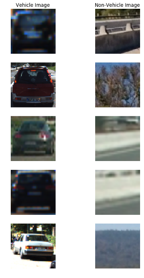
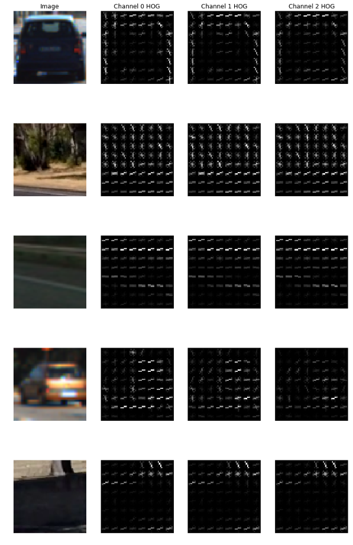
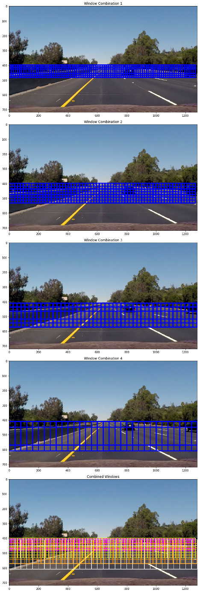
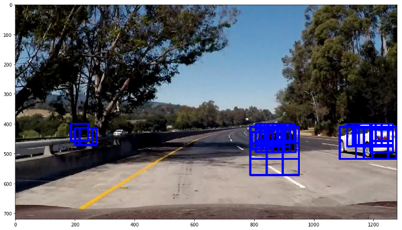
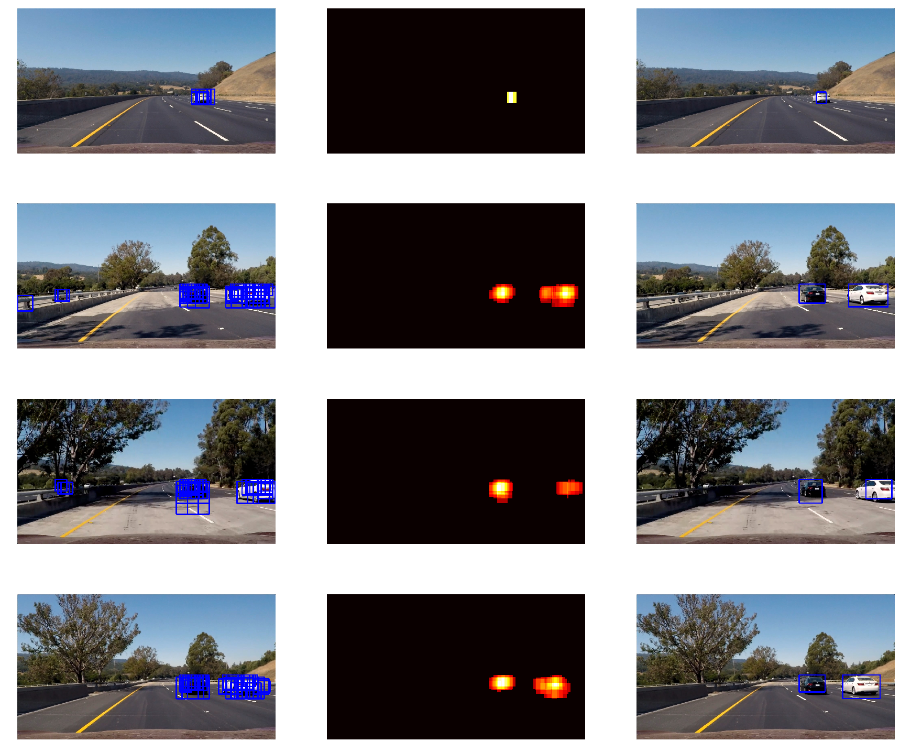
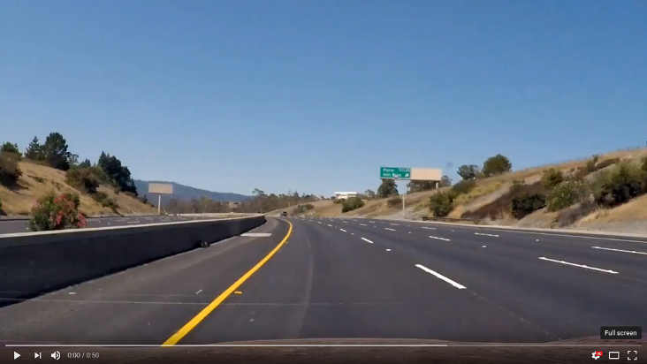

# Machine Learning for Vehicle Detection

In the fifth project of the [udacity self-driving car engineer course](https://eu.udacity.com/course/self-driving-car-engineer-nanodegree--nd013), I trained a Support Vector Machine (SVM) model to detect moving vehicles on the road.

The project consisted of the following stages:
1. Perform feature engineering on dataset.
2. Train an SVM classifier on extracted features.
3. Implement sliding-window technique to detect vehicles in an image.
4. Use heatmap to filter non-vehicle windows and draw bounding box around vehicles.
5. Produce a pipeline and generate video of results.

The training dataset for this project consisted of vehicle and non-vehicle images as per the following samples:



**In total, the training set contained 8,793 vehicle images and 8,968 non-vehicle images.**

## Feature Engineering

The first step in the project was performing [feature engineering](https://en.wikipedia.org/wiki/Feature_engineering) on the training dataset to identify the ideal feature descriptors to use. Three feature descriptors were considered: [Histogram of Oriented Gradients (HOG)](https://en.wikipedia.org/wiki/Histogram_of_oriented_gradients) features, [spatial binning](https://en.wikipedia.org/wiki/Data_binning) features, and [color histogram](https://en.wikipedia.org/wiki/Color_histogram) features.

The HOG feature descriptor was popularised by researchers Navneet Dalal and Bill Triggs in their paper [Histogram of Oriented Gradients for Human Detection](https://hal.inria.fr/inria-00548512/document/). HOG calculates a distribution of gradient orientations in localized parts of an image. The following is a visualization of HOG features on a sample of images for each of the image's three colour channels:



A thorough description of how HOG is calculated can be found in [this](https://www.learnopencv.com/histogram-of-oriented-gradients/) article.

The second feature descriptor used was spatial binning; to calculate this feature descriptor, OpenCV's [resize](https://docs.opencv.org/2.4/modules/imgproc/doc/geometric_transformations.html#resize) function was used. The resize function performs a linearly interpolated spatial binning operation when downsizing images.

The third feature descriptor used was colour distribution (histogram). A histogram for each of the colour channels in an image was calculated, then the three histograms were combined to produce a single feature vector.

Images were initially converted to the [YCbCr](https://en.wikipedia.org/wiki/YCbCr) colorspace after experimentation showed that it was the ideal colorspace that resulted in highest accuracy during prediction. Then, a combined feature vector for each image was constructed from each of the three feature descriptors. This combined feature vector was the one used to train the predictive model.

## SVM Training

With our feature engineering completed, the next step was implementing a predictive model that is able to figure out if the feature vector belonged to a vehicle or a non-vehicle.

A linear [Support Vector Machine (SVM)](http://scikit-learn.org/stable/modules/generated/sklearn.svm.SVC.html) model was chosen as the predictive algorithm of choice. I played around with the model's hyper-parameters; a **C** value of 0.001 and **max iterations** of 10,000 resulted in a high accuracy of around 98%. The following is the code used to implement the model:


```python
from sklearn.svm import LinearSVC
from sklearn.model_selection import cross_val_score

SVC_ITER = 10000
SVC_C = 0.001
CV_ITERS = 4

SVC = LinearSVC(C=SVC_C, max_iter=SVC_ITER)
SVC.fit(X_train, y_train)
cv_scores = cross_val_score(SVC2, X, y, cv=CV_ITERS)
print("Accuracy: %0.2f (+/- %0.2f)" % (cv_scores.mean(), cv_scores.std() * 2))
```

The model took around 12 minutes to train, which is a relatively short period of time for a machine learning model.

## Sliding-Window Search

In order to use our predictive model on a video feed, we need to come up with an appropriate and consistent partitioning algorithm that lets us search our video feed image. The searching algorithm should return sub-images from the image which are then fed into our model to make a prediction. One such searching algorithm is the sliding-window search technique. 

A sliding-window search splits a search area into smaller equally-sized overlapping areas depending on the pre-selected scale. In our case, we need sliding-window areas with different scales to account for the fact that cars further away will appear smaller and cars closer will appear larger. The following are four different combinations of sliding-window search with the final combined windows in the last image:



The above sliding-window search was applied to each image in the video frame. **In total, there were 697 windows that were fed into the model per image.**

## Heatmap Thresholding

When we feed our extracted windows into our predictive model, the result is a list of windows (of various scales) where a vehicle was detected, as per the following image:



Now given the simplicity of the SVM model, we expect some detections to be false positives. In order to filter out these incorrect detections, one approach is to threshold our positive windows such that we only pick areas where more than one window overlap. In essence we are generating a heatmap of the positive windows.

The following images show heatmap thresholding applied to searched images:



In addition, using the generated heatmap, we can then calculate bounding boxes on the detected object using the location of the pixels furthest away from the centre of the heatmap. These bounding boxes are used to visually identify our detected cars as per the set of images in the last column of the above image.

## Results

The end result is a pipeline that goes as follows for each image in the feed:
1. Extract all search windows from image.
2. Convert each window image to **YCbCr** colour space and extract features.
3. Feed each feature into SVM model and filter out non-positive matches (non-vehicles).
4. Apply heatmap thresholding to positive matches and draw bounding boxes.

The pipeline was run on a video of the car driving. Below is a video demonstrating the pipeline in action:

[](https://youtu.be/e7pga5oz_Mw)
